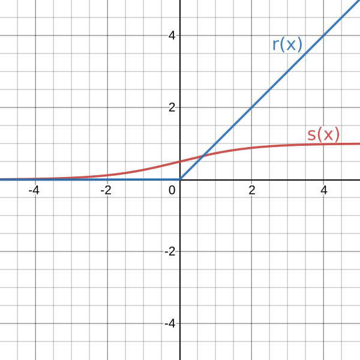

# Introduction

The **multilayer perceptron** is one of the most common type of neural networks. Specifically, a feedfoward artificial neural network (**FFNN**).

The fundamental components of a neural network are:

- **Weights**: They're used to determine the importance of a single neuron with respect to the next neuron.
- **Neurons**: They're like cells of the network that have the task of computing the [weighted sum](https://qr.ae/pGEzdE) of the neurons on the previous layer (called *inputs*) through the use of *weights*.
- **Biases**: They help to determine how easy it is for the network to consider their associated neuron active[^1], i.e. with a big bias it's easy for the neuron to be active, but with a negative bias it's more difficult.

All neurons of this type of perceptron are connected between each layer.

{width=180px}

<!-- TODO: Input layer, Hidden layers, Output layer -->

## Linearity

### Linear perceptron

Linear perceptrons classifiers, also called **single-layer perceptrons**, are the _simplest_ feedfoward neural network available.

They're limited to to _linearly separable_ datasets, which are a set of points that **can** be separated by a linear function for classification.

{width=250px}

As it can be seen on **Figure 2**, the straight line $f(x)$ is able to separate the set of _blue_ and _orange_ points correctly, which allows a linear perceptron to classify them.

Ideally, the network just has to learn what the values of the slope $m$ and the intercept $q$ are for the line $f(x) = mx + q$.

### Non-linear perceptron

For a more complex classification, **multilayer perceptrons** are necessary.

As the name implies, for a perceptron to be _multilayer_ it has to have at least one hidden layer. \
Furthermore, a non-linear _activation function_ **must** be used for the network the be non-linear itself.

<!-- TODO: Mention forward propagation on the weighted sum -->
An **activation function** is a function that changes the weighted sum of a neuron to be non-linear.

The two main activation functions are the **sigmoid** and the **ReLU** function as shown in **Figure 3**.

{width=180px}

The equation for the _sigmoid_ function is $s(x)=\frac{1}{1 + e^{-x}}$, which maps its values to the range $\left[0, 1\right]$. \
The _ReLU_ is expressed as $r(x)=max(0, x)$ and it ignores everything but the positive part of its argument.

<!-- TODO:
This type of network is considered to be capable of approximating any continuous function[^2], as proven by the [**universal approximation theorem**](https://en.wikipedia.org/wiki/Universal_approximation_theorem).

{width=250px}
-->

[^1]: [What is the role of the bias in neural networks?](https://stackoverflow.com/a/54651771)
[^2]: [The Universal Approximation Theorem for neural networks](https://www.youtube.com/watch?v=Ijqkc7OLenI)
